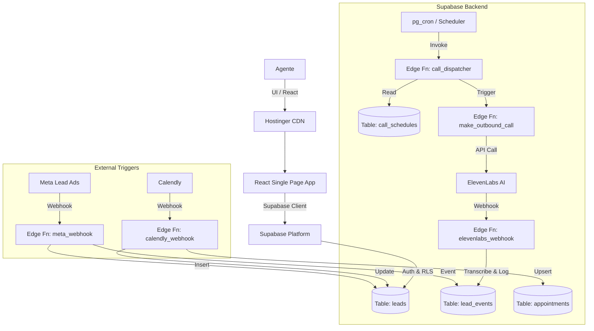

# Especificación de Arquitectura - Financie CRM

## 1. Visión General
Financie CRM es una aplicación **Serverless** y **Event-Driven** diseñada para gestionar leads de seguros de manera automatizada. Se compone de una Single Page Application (SPA) para el frontend y un backend basado enteramente en funciones Cloud (Edge Functions) y servicios gestionados.

### Principios Arquitectónicos
1.  **Serverless First**: No existen servidores persistentes (EC2, Droplets). Toda la lógica corre en Supabase Edge Functions (Deno).
2.  **Event Sourcing Light**: El estado actual de un lead es importante, pero la historia de lo que sucedió es crítica. Se usa un modelo "Append-Only" para logs de auditoría en la tabla `lead_events`.
3.  **Single Tenant / RLS Estricto**: Aunque la base de datos es compartida (Postgres), la seguridad se aplica a nivel de fila (Row Level Security) para aislar datos, permitiendo un modelo de seguridad simple pero robusto.
4.  **Asincronía & Jobs**: Las tareas pesadas o propensas a fallos (llamadas, emails) no se ejecutan síncronamente en el request del usuario, sino que se encolan como `jobs` o se programan via `call_schedules`.

## 2. Diagrama de Alto Nivel

## 3. Modelo de Datos y Seguridad

### 3.1 Row Level Security (RLS)
El proyecto utiliza un modelo de seguridad donde el acceso a los datos está restringido por defecto.
- **Autenticación**: Supabase Auth (GoTrue).
- **Políticas**:
    - `SELECT/INSERT/UPDATE`: Permitido solo a usuarios autenticados (`auth.role() = 'authenticated'`).
    - **Service Role**: Las Edge Functions operan con `service_role_key` para bypass de RLS cuando es necesario (ej: Webhooks públicos de Meta).

### 3.2 Ciclo de Vida del Dato (Lead)
1.  **Ingesta**: Lead ingresa `status = 'new'`, `marketing_consent = true`.
2.  **Orquestación**: Un Trigger de DB (`tr_orchestrate_new_lead`) detecta el insert y crea un `job` inicial o un `call_schedule` activo.
3.  **Procesamiento**: El Dispatcher evalúa reglas de horario (Timezone de EE.UU.) y reintentos.
4.  **Contacto**: Se realiza la llamada. Si contesta, el evento `call.answered` detiene futuros intentos automáticos.

## 4. Stack Tecnológico

| Capa | Tecnología | Rol |
| :--- | :--- | :--- |
| **Frontend** | React, Vite, Tailwind | Interfaz de Usuario (SPA). |
| **Hosting Front** | Hostinger | Alojamiento de archivos estáticos. |
| **Backend Logic** | Supabase Edge Functions | Lógica de negocio, validaciones, integraciones. |
| **Database** | PostgreSQL (Supabase) | Persistencia relacional y JSONB. |
| **Auth** | Supabase Auth | Gestión de sesiones y usuarios. |
| **AI Voice** | ElevenLabs | Generación de llamadas de voz conversacionales. |
| **Orquestación** | pg_cron + Tablas Jobs | Cola de tareas y scheduling. |

## 5. Integraciones Externas
- **Meta Graph API**: Validación de leads y obtención de detalles adicionales.
- **Calendly API v2**: Webhooks firmados para sincronización de agenda.
- **ElevenLabs ConvAI**: Webhooks bidireccionales para control de llamadas.
