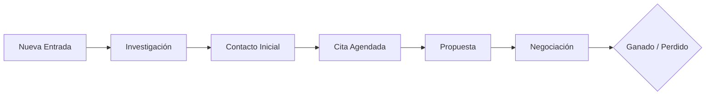

# 00 — Introducción y Conceptos Clave

Este manual está diseñado para que el Agente de Seguros domine el Financie CRM, optimizando su flujo de trabajo y maximizando su tasa de cierre de pólizas. El sistema no solo organiza datos, sino que actúa como un copiloto inteligente.

## El Flujo de Vida de un Lead

En Financie CRM, un prospecto (Lead) atraviesa un ciclo de vida diseñado para minimizar la fricción y asegurar que ninguna oportunidad se pierda.

## Conceptos Fundamentales

### 1. Sistema de Registro vs. Sistema de Inteligencia
`[FACT]` A diferencia de una hoja de cálculo, el CRM utiliza **Lead Events** para registrar cada interacción. Esto significa que cada clic, llamada o cambio de etapa genera una traza auditable.

### 2. Gobernanza de Etapa (Stage Gates)
`[FACT]` El sistema implementa "Puertas de Validación". No podrás mover un lead a etapas avanzadas si faltan datos críticos (ej: no puedes marcar un lead como "Won" sin haber subido la póliza o el contrato).

### 3. Lead Scoring conductual
`[INFERENCE]` El sistema asigna un puntaje basado en la probabilidad de cierre. Un lead con puntaje alto (80-100) debe ser tu prioridad absoluta al iniciar el día.

## Primeros Pasos
1. **Verifica tu Conexión:** Asegúrate de estar en el dominio correcto de tu organización.
2. **Revisa tu Dashboard:** Familiarízate con tus métricas personales de eficiencia.
3. **Explora el Kanban:** El Tablero Kanban será tu centro de control diario para mover prospectos.

---
> [!TIP]
> Mantén tus leads actualizados en tiempo real. La inteligencia del sistema depende de la frescura de los datos que ingresas.
