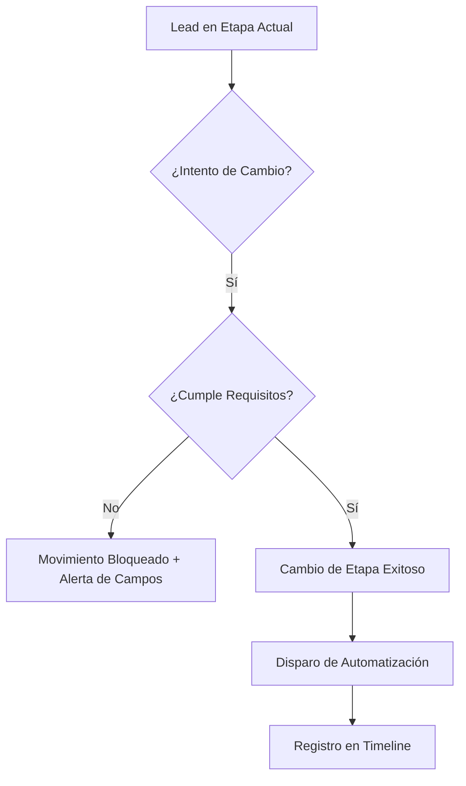

# 02 — Gestión de Pipeline y Ventas

El Pipeline es la representación visual de tu proceso comercial. En Financie CRM, el pipeline no es solo decorativo; es un motor de gobernanza que asegura la integridad de tus ventas.

## Tablero Kanban
El CRM utiliza un tablero tipo Kanban donde cada tarjeta representa un Lead.
- **Movimiento:** Desplaza las tarjetas de izquierda a derecha según el progreso del trato.
- **Acciones Rápidas:** Desde la tarjeta puedes ver el valor del trato, el nombre del prospecto y la última actividad realizada.

## Múltiples Pipelines
`[FACT]` El CRM soporta diferentes ciclos de venta. Puedes alternar entre, por ejemplo, un pipeline de "Nuevos Negocios" y uno de "Renovaciones".
- **Uso:** Utiliza el selector de pipeline en la parte superior para cambiar de contexto. Cada pipeline tiene sus propias etapas y reglas de probabilidad.

## Gobernanza por Etapas (Stage Gates)
Para asegurar que los datos sean confiables, el sistema impone restricciones de movimiento.

### Reglas de Validación
| Etapa Destino | Requisito Mandatorio |
|---|---|
| **Propuesta** | El campo "Valor del Trato" debe ser mayor a 0. |
| **Negociación** | Debe haber al menos una nota de "Requerimientos del Cliente". |
| **Ganado (Won)** | Checkbox "Contrato Firmado" marcado y PDF de póliza adjunto. |

### Feedback de Error (Ghost Drop)
> [!WARNING]
> Si intentas mover un lead a una etapa sin cumplir los requisitos, la tarjeta regresará automáticamente a su posición original y verás un panel lateral indicando qué campos faltan completar.

## Automatización de Acciones (Auto-Triggers)
Al entrar en ciertas etapas, el sistema trabaja por ti:
1. **Etapa "Nuevo":** Se genera automáticamente una tarea de investigación inicial.
2. **Etapa "Ganado":** El sistema envía automáticamente un correo de bienvenida y crea el recordatorio de Onboarding.
3. `[FACT]` Todas estas acciones se registran en la línea de tiempo del lead con el icono de un robot para distinguirlas de tus acciones manuales.

---
### Flujo de Gobernanza Visual

